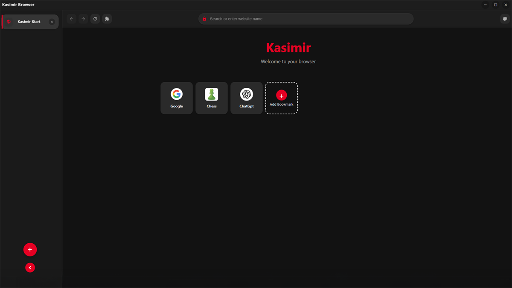

# Kasimir Browser 

⚠️ **BETA / WORK IN PROGRESS** ⚠️  
This project is in early development. Features may be incomplete, unstable, or might change significantly. Don't take it too seriously yet – we're still working on it!

---

## 🌟 Features



- **Modern UI**  
- **Vertical sidebar tabs** for better screen space utilization  
- **Startup animation** with a slick modern design  
- **Bookmarks management** on the homepage  
- **Keyboard shortcuts** for common browser operations  
- **Tab management** with drag-and-drop support  

---

## 🚀 Installation

```bash
# Clone the repository
git clone https://github.com/user1342554/Kasimir-Browser.git

# Navigate to the project directory
cd Kasimir-Browser

# Install dependencies
npm install

# Start the application
npm start

# Build for your platform
npm run dist
```

---

## 🛠️ Development

Kasimir Browser is built using:

- Electron  
- HTML / CSS / JavaScript  
- No frameworks – just vanilla code!

---

## 🔑 Keyboard Shortcuts

- `Ctrl+T` – New tab  
- `Ctrl+W` – Close tab  
- `Ctrl+Tab` / `Ctrl+Shift+Tab` – Next / previous tab  
- `Ctrl+L` – Focus address bar  
- `Ctrl+R` or `F5` – Reload page  
- `Alt+Left/Right` – Back / forward  
- `Ctrl+,` – Open settings  

---

## 🚧 Status

This project is currently in **BETA** and under active development. Many features are experimental and subject to change. Consider this a fun project to explore rather than a daily driver browser!

**Known limitations:**
- Some features may not work as expected  
- Performance optimizations are still in progress  
- Security features are not fully implemented  

---

## 📄 License

This project is licensed under the MIT License – see the [LICENSE](LICENSE) file for details.

---

## 🤝 Contributing

Since this is a work in progress, contributions are welcome but please understand that the project architecture may change significantly as it develops.

---

*Kasimir Browser is a personal project and not intended for production use. Have fun with it, but maybe don't use it for your banking just yet! 😉*

